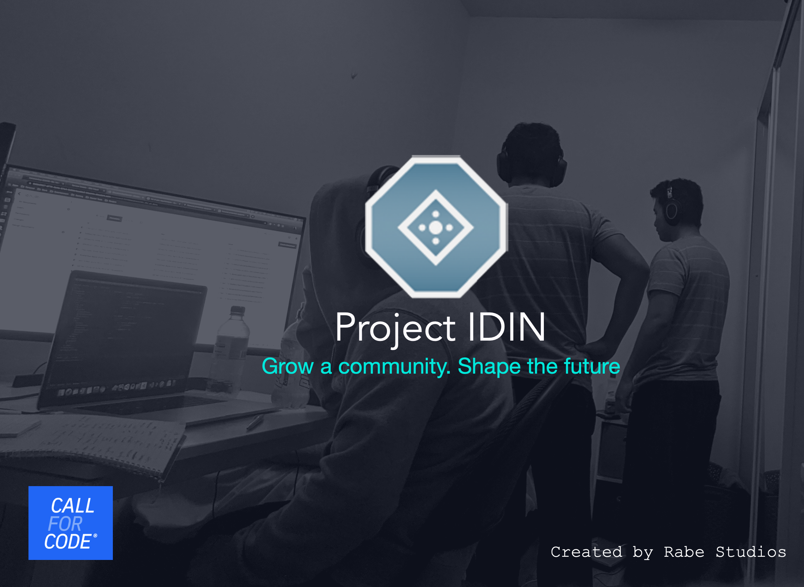
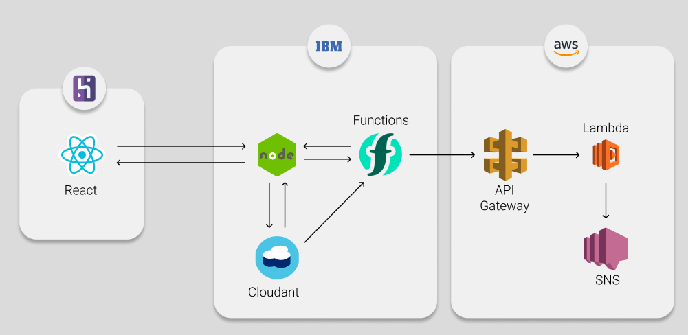

[](http://www.youtube.com/watch?v=CJchKYX8Pzw "Project IDIN Demo Video")

# Project IDIN
> Automated resource sharing and inventory management platform

During the COVID-19 pandemic, hospitals all around the world are
experiencing shortages in equipment such as protective gear and
respiratory tools. Inventory Distribution Network (IDiN)  was created to
address this issue through the use of predictive analysis to allow hospitals 
to preemptively order items from suppliers or redistribute their supplies to 
and from neighbouring hospitals. IDiN is responsible for monitoring and analysing trends
of a hospital’s inventory, and then takes action based on its predictions. IDiN could send a 
message to neighbouring hospitals who are overstocked with supplies or preemptively notify suppliers 
about upcoming shortages. This application encourages collaboration between business and communities to overcome 
this global pandemic.

## Useful Links
- Demo: https://project-idin.herokuapp.com/
- Issue Tracker: https://github.com/chrisrabe/project-idin/issues
- Repository: https://github.com/chrisrabe/project-idin

## Features
- Interactive web application
- Inventory and transaction tracking
- Automated requests when the system detects that inventory is low

## Architecture


1. React front-end sends and receives data from NodeJS server hosted in IBM cloud
2. Server stores information on Cloudant database
3. New or updated items trigger a Cloud Function
4. Cloud function requests server for predictions and raises respective requests
5. Cloud function forwards email to AWS API Gateway, which triggers an AWS Lambda
6. AWS Lambda sends emails through AWS SNS

## Installing / Getting started

- [IDIN Client installation, configuration, and deployment](idin-client/README.md)
- [IDIN Server installation, configuration, and deployment](idin-server/README.md)
- [IDIN Cloud function set up and deployment](idin-cloud-func/README.md)

## Developing

If you wish to contribute to the development of Project IDIN,
simply clone the repository, make your changes and raise a pull requests
```shell
git clone https://github.com/chrisrabe/project-idin.git
cd project-idin/
```

**Please make sure that you own your own Cloudant database if you wish to develop**

## Configuration
You will need to add the following arguments

#### Cloudant username
Type: `String`    
Default: `'<username>'`    
Location: 
- `idin-server/config/default.json`
- `idin-server/config/production.json`

The username of your cloudant service.

#### Cloudant apiKey
Type: `String`  
Default: `'<apiKey>'`    
Location: 
- `idin-server/config/default.json`
- `idin-server/config/production.json`

apiKey of your cloudant service

#### Cloud Foundry App URL
Type: `String`  
Default: `'https://<my-server>.mybluemix.net'`    
Location:
- `idin-client/src/config/index.js`
- `idin-cloud-func/main.js`

Retrieved after you deploy your IBM Cloud Foundry app.
This is where your app will send requests to

## Contributing
If you wish to contribute to this project, feel free to clone or fork the repository and then
make a pull request. I'm always open to new ideas and I grately appreciate all the support I can get.
I made this application as a solo developer with the goal to help medical staff deal with the pandemic.
I am very humbled to meet anyone else who wishes to build on it. The goal is to make
this the best possible automated resource sharing and inventory management platform. With your help, we're
just one step closer! Thank you for your work!

## Licensing


"The code in this project is licensed under Apache-2.0 license."
